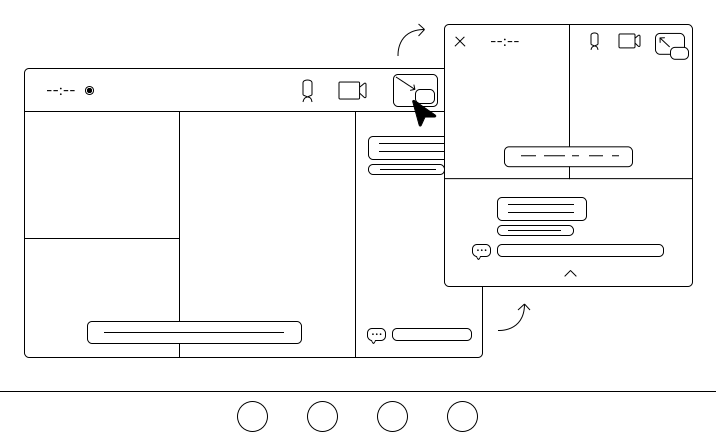

# Document Picture-in-Picture Explained

2022-10-31

## What's all this then?

There currently exists a Web API for putting an `HTMLVideoElement` into a
Picture-in-Picture window (`HTMLVideoElement.requestPictureInPicture()`). This
limits a website's ability to provide a custom picture-in-picture experience
(PiP). We want to expand upon that functionality by giving websites the ability
to open a picture-in-picture (i.e., always-on-top) window with a blank document
that can be populated with arbitrary `HTMLElement`s instead of only a single
`HTMLVideoElement`.

This new window will be much like a blank same-origin window opened via the
existing `window.open()` API, with some differences:

- The PiP window will float on top of other windows.
- The PiP window will never outlive the opening window. This means any
  navigations that change the opener to a new document (even same-origin
  navigations) will cause the PiP window to close, similar to the existing
  `HTMLVideoElement.requestPictureInPicture()` API.
- The website cannot set the position of the PiP window.
- The PiP window cannot be navigated (any `window.history` or `window.location`
    calls that change to a new document will close the PiP window).
- The website can have only one PiP window open at a time, and the user agent
  may also restrict how many PiP windows can be open globally, similar to
  `HTMLVideoElement.requestPictureInPicture()` API.

### Goals

- Allow a website to display arbitrary `HTMLElements` in an always-on-top
  window.
- To be simple for web developers to use and understand. Note that while
  allowing websites to call `requestPictureInPicture()` on any element would be
  the simplest way, for reasons described below, this isn't feasible.

### Non-goals

- This API is not attempting to handle placeholder content for elements that are
  moved out of the page (that is the responsibility of the website to handle).
- Allowing websites to open always-on-top widgets that outlive the webpage (the
  PiP window will close when the webpage is closed).

### Use cases

#### Custom video player

While the existing Picture-in-Picture API for HTMLVideoElement allows a website
to provide a Picture-in-Picture video experience, it is very limited in what
inputs the window can take and the look-and-feel of those inputs. With a full
Document in Picture-in-Picture, the website can provide custom controls and
inputs (e.g. captions, playlists, time scrubber, liking/disliking videos, etc)
to improve the user's PiP video experience.


#### Video conferencing

It is common for users to leave the tab during a video conferencing session for
various reasons (e.g. presenting another tab to the call or multitasking) while
still wishing to see the call, so it's a prime use case for Picture-in-Picture.
As above, the current experience a video conferencing website can provide via
the HTMLVideoElement PiP API is limited in style and input. With a full Document
in Picture-in-Picture, the website can easily combine multiple video streams
into a single PiP window and provide custom controls like sending a message,
muting another user, raising a hand, etc.




#### Pomodoro timers

The Pomodoro technique is a time management method that uses a kitchen timer to
break work into intervals, typically 25 minutes in length, separated by short
breaks. Pomodoro timer apps on desktop and mobile can use the PiP feature to
display the current timer permanently on the screen as a floating timer for
timed focus management while sat at a desk or while on the go.


## Example code

### HTML

```html
<body>
  <div id="player-container">
    <div id="player">
      <video id="video" src="foo.webm"></video>
      <!-- More player elements here. -->
    </div>
  </div>
  <input type="button" onclick="enterPiP();" value="Enter PiP" />
</body>
```

### JavaScript

```js
// Handle to the picture-in-picture window.
let pipWindow = null;

async function enterPiP() {
  const player = document.querySelector("#player");

  const pipOptions = {
    width: player.clientWidth,
    height: player.clientHeight,
  };

  pipWindow = await documentPictureInPicture.requestWindow(pipOptions);

  // Style remaining container to imply the player is in PiP.
  const playerContainer = document.querySelector("#player-container");
  playerContainer.classList.add("pip-mode");

  // Add player to the PiP window.
  pipWindow.document.body.append(player);

  // Listen for the PiP closing event to put the video back.
  pipWindow.addEventListener("unload", onLeavePiP.bind(pipWindow), {
    once: true,
  });
}

// Called when the PiP window has closed.
function onLeavePiP() {
  if (this !== pipWindow) {
    return;
  }

  // Remove PiP styling from the container.
  const playerContainer = document.querySelector("#player-container");
  playerContainer.classList.remove("pip-mode");

  // Add the player back to the main window.
  const pipPlayer = pipWindow.document.querySelector("#player");
  playerContainer.append(pipPlayer);

  pipWindow = null;
}
```

## Key scenarios

### Accessing elements on the PiP window

```js
const pipVideo = pipWindow.document.querySelector("#video");
pipVideo.loop = true;
```

### Listening to events on the PiP window

As part of creating an improved picture-in-picture experience, websites will
often want customize buttons and controls that need to respond to user input
events such as clicks.

```js
const pipVideo = pipWindow.document.querySelector("#video");
const pipMuteButton = pipWindow.document.createElement("button");
pipMuteButton.textContent = "Toggle mute";
pipMuteButton.addEventListener("click", () => {
  pipVideo.muted = !pipVideo.muted;
});
pipWindow.document.body.append(pipMuteButton);
```

### Exiting PiP

The website may decide to close the `DocumentPictureInPicture` window without
the user explicitly clicking on the window's close button. They can do this by
using the `close()` method on the `Window` object:

```js
// This will close the PiP window and trigger our existing onLeavePiP()
// listener.
pipWindow.close();
```

### Getting elements out of the PiP window when it closes

When the PiP window is closed for any reason (either because the website
initiated it or the user closed it), the website will often want to get the
elements back out of the PiP window. The website can perform this in an event
handler for the `unload` event on the `Window` object. This is shown in the
`onLeavePiP()` handler in [Example code](#example-code) section above and is
copied below:

```js
// Called when the PiP window has closed.
function onLeavePiP() {
  if (this !== pipWindow) {
    return;
  }

  // Remove PiP styling from the container.
  const playerContainer = document.querySelector("#player-container");
  playerContainer.classList.remove("pip-mode");

  // Add the player back to the main window.
  const pipPlayer = pipWindow.document.querySelector("#player");
  playerContainer.append(pipPlayer);

  pipWindow = null;
}
```

## Detailed design discussion

### Why not extend the `HTMLVideoElement.requestPictureInPicture()` idea to allow it to be called on any `HTMLElement`?

Any API where the UA is taking elements out of the page and then reinserting
them ends up with tricky questions on what to show in the current document when
those elements are gone (do elements shift around? Is there a placeholder? What
magic needs to happen when things resize? etc). By leaving it up to websites to
move their own elements, the API contract between the UA and website is much
clearer and simpler to understand.

### Since this is pretty close to `window.open()`, why not just add an `alwaysOnTop` flag to `window.open()`?

The main reason we decided to have a completely separate API is to make it
easier for websites to detect it (since in most cases, falling back to a
standard window would be undesirable and websites would rather use
`HTMLVideoElement` PiP instead). Additionally, it also works differently enough
from `window.open()` (e.g., never outliving the opener) that having it separate
makes sense.

### Why not give the website more control over the size/position of the window?

Giving websites less control over the size/position of the window will help
prevent, e.g., phishing attacks where a website pops a small always-on-top
window over an `input` element to steal your password.

## Considered alternatives

Surface Element was a proposal where the website would wrap PiP-able content in
advance with a new type of iframe-like element that could be pulled out into a
separate window when requested. This had some downsides including always
requiring the overhead of a separate document (even in the most common case of
never entering picture-in-picture).

We also considered a similar approach to the one in this document, but with no
input allowed in the DOM (only allowlisted controls from a predetermined list in
a similar fashion to the existing `HTMLVideoElement` PiP). One issue with this
approach is that it really didn't help websites do much more than they already
can today, since a website can draw anything in a canvas element and PiP a video
with the canvas as a source. `Having HTMLElements` that can actually be
interacted with is what makes the Document Picture-in-Picture feature worth
implementing.

## References and acknowledgements

Many thanks to Frank Liberato, Mark Foltz, Klaus Weidner, François Beaufort,
Charlie Reis, Joe DeBlasio, Domenic Denicola, and Yiren Wang for their comments
and contributions to this document and to the discussions that have informed it.
Special thanks to Mikaela Watson and Glen Anderson for the initial wireframes.
